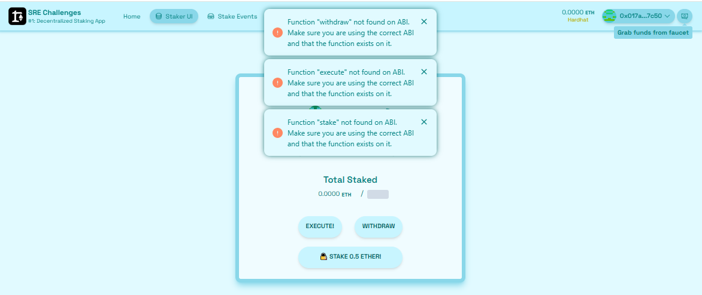

# 🚩 Challenge 1: 🔏 Decentralized Staking App Explicado en Español


🦸 Resumen del desafío: *Decentralized Staking App* Este desafío consiste en crear una aplicación descentralizada que permita a las personas usuarias enviar fondos a un contrato inteligente, con las siguientes reglas:

- Período de stake:

  - Las personas usuarias pueden enviar ETH al contrato durante un tiempo limitado (definido por un deadline).
  - El contrato rastrea cuánto ha enviado cada persona usuaria utilizando un mapping.

- Condiciones de éxito:
  
  - Si antes del deadline el contrato acumula al menos 1 ETH (threshold), los fondos se envían a otro contrato (ExampleExternalContract) y ejecutan una función llamada complete().

- Fallo del objetivo:

  - Si no se alcanza el threshold antes del deadline, las personas usuarias pueden retirar sus fondos.

- Frontend y experiencia de usuario:

  - El reto incluye construir una interfaz para interactuar con el contrato: mostrar cuánto ETH ha sido staked, cuánto tiempo queda, y permitir stake o retiro.


🏦 Build a `Staker.sol` contract that collects **ETH** from numerous addresses using a payable `stake()` function and keeps track of `balances`. After some `deadline` if it has at least some `threshold` of ETH, it sends it to an `ExampleExternalContract` and triggers the `complete()` action sending the full balance. If not enough **ETH** is collected, allow users to `withdraw()`.

🎛 Building the frontend to display the information and UI is just as important as writing the contract. The goal is to deploy the contract and the app to allow anyone to stake using your app. Use a `Stake(address,uint256)` event to list all stakes.

🌟 The final deliverable is deploying a Dapp that lets users send ether to a contract and stake if the conditions are met, then `yarn vercel` your app to a public webserver. 

---

## Checkpoint 0: 📦 Environment 📚

Before you begin, you need to install the following tools:

- [Node (v18 LTS)](https://nodejs.org/en/download/)
- Yarn ([v1](https://classic.yarnpkg.com/en/docs/install/) or [v2+](https://yarnpkg.com/getting-started/install))
- [Git](https://git-scm.com/downloads)

> in the same terminal, start your local network (a blockchain emulator in your computer):

```sh
yarn chain
```

> in a second terminal window, 🛰 deploy your contract (locally):

```sh
cd challenge-1-decentralized-staking
yarn deploy
```

> in a third terminal window, start your 📱 frontend:

```sh
cd challenge-1-decentralized-staking
yarn start
```

📱 Open http://localhost:3000 to see the app.

> 👩‍💻 Rerun `yarn deploy` whenever you want to deploy new contracts to the frontend. If you haven't made any contract changes, you can run `yarn deploy --reset` for a completely fresh deploy.

🔏 Now you are ready to edit your smart contract `Staker.sol` in `packages/hardhat/contracts`

## Checkpoint 1: 🔏 Staking 💵

You'll need to track individual `balances` using a mapping:

```solidity
mapping ( address => uint256 ) public balances;
```

And also track a constant `threshold` at `1 ether`

```solidity
uint256 public constant threshold = 1 ether;
```

> 👩‍💻 Write your `stake()` function and test it with the `Debug Contracts` tab in the frontend.

> 💸 Need more funds from the faucet? Click on _"Grab funds from faucet"_, or use the Faucet feature at the bottom left of the page to get as much as you need!

> ✏ Need to troubleshoot your code? If you import `hardhat/console.sol` to your contract, you can call `console.log()` right in your Solidity code. The output will appear in your `yarn chain` terminal.

### 🥅 Goals

- [ ] Do you see the balance of the `Staker` contract go up when you `stake()`?
- [ ] Is your `balance` correctly tracked?
- [ ] Do you see the events in the `Stake Events` tab?

---
### Checkpoint 1: 🔏 Staking 💵 Explicado en Español

Hoy en día en el front vas a poder observar en *staker UI* botones que no funcionan (esto es lo que debemos programar):



🔏 Ahora es necesario editar tu contrato inteligente Staker.sol en packages/hardhat/contracts.

- El archivo Staker.sol es el contrato principal que vas a modificar para este desafío. Vas al directorio mencionado (packages/hardhat/contracts) y abre ese archivo. Vas a implementar funciones que permitan a las personas usuarias "apostar" (o stakear) fondos en tu contrato. Esto implica almacenar balances individuales y establecer un umbral de 1 ether para ciertas acciones.

#### Paso 1: Agregar la variable balances

En este caso se debe rastrear los saldos individuales de las personas usuarias usando un mapping:

```solidity
mapping ( address => uint256 ) public balances;
```

Un mapping en Solidity es como una tabla que relaciona una dirección (address) con un valor (uint256), en este caso, cada dirección tendrá un saldo asociado. public hace que esta variable sea accesible directamente desde fuera del contrato.

> Tarea: Agregar esta línea dentro de tu contrato Staker.sol. Quedará algo como

```solidity
contract Staker {
    mapping (address => uint256) public balances;
}
```
#### Paso 2: Agregar la constante threshold

También vas a necesitar rastrear una constante llamada threshold con un valor de 1 ether:

```solidity
uint256 public constant threshold = 1 ether;
```

- uint256: Representa un número entero sin signo.
- constant: Significa que este valor no puede cambiar una vez definido.
- 1 ether: Es una unidad predefinida en Solidity que equivale a 10^18 wei (la unidad más pequeña de Ethereum).

> Tarea: Agrega esta línea después del mapping. Ahora tu contrato debería verse como:

```solidity
contract Staker {
    mapping (address => uint256) public balances;
    uint256 public constant threshold = 1 ether;
}
```

#### Paso 3: Implementar la función stake()

 👩‍💻 Escribe tu función stake() y pruébala en la pestaña Debug Contracts del frontend.

 ¿Qué es la función stake()? Es una función que permite a las personas usuarias enviar Ether al contrato y registrar su saldo. Se debe usar la variable balances para actualizar el saldo del usuario que llamó a la función.

 ```solidity
function stake() public payable {
    // Incrementa el saldo del remitente con la cantidad enviada
    balances[msg.sender] += msg.value;
}
```

- *msg.sender*: Es la dirección de la persona usuaria que llama a la función.
- *msg.value*: Es la cantidad de Ether enviada junto con la llamada a la función.
- *+=*: Suma el valor enviado al saldo existente.

Prueba inicial: Una vez implementada, hay que ir al frontend y utiliza la pestaña "Debug Contracts" para llamar a stake() enviando un monto (por ejemplo, 0.1 ether).

#### Paso 4: Obtener fondos del Faucet

💸 ¿Necesitas más fondos? Haz clic en "Grab funds from faucet" o utiliza la funcionalidad de Faucet en la esquina superior izquierda para obtener lo que necesites.

- ¿Qué significa? Si te quedas sin Ether en tu billetera de desarrollo, puedes usar el "Faucet" (un grifo) para obtener más Ether falso en la red local de Hardhat.

- Cómo hacerlo: Desde el frontend, busca el botón "Grab funds from faucet" y úsalo para agregar más fondos a tu billetera.

#### Paso 5: Debug con console.log

✏ ¿Necesitas solucionar problemas? Si importas hardhat/console.sol en tu contrato, puedes usar console.log() directamente en tu código Solidity.

- ¿Qué es esto? console.log() te permite imprimir mensajes o valores en la terminal donde ejecutas yarn chain. Útil para verificar valores como msg.sender, msg.value, o balances.

 ```solidity
import "hardhat/console.sol";

function stake() public payable {
    balances[msg.sender] += msg.value;
    console.log("Balance actualizado para:", msg.sender, "Nuevo saldo:", balances[msg.sender]);
}
```

> Tarea:Importa console.sol y usa console.log() para depurar.

#### Objetivos Finales
🥅 Metas a lograr:

- ¿Ves que el balance del contrato Staker aumenta cuando llamas a stake()? Cuando envíes Ether al contrato usando stake(), el saldo total del contrato debe reflejarse en el explorador (frontend).

- ¿Se rastrean correctamente los balances de los usuarios? Cada usuario que llama a stake() debe tener su saldo correctamente almacenado en el mapping balances.

- ¿Ves eventos en la pestaña "Stake Events"? En pasos posteriores, emitirás eventos para registrar cada vez que alguien haga staking.

## Checkpoint 2: 🔬 State Machine / Timing ⏱

### State Machine

> ⚙️ Think of your smart contract like a _state machine_. First, there is a **stake** period. Then, if you have gathered the `threshold` worth of ETH, there is a **success** state. Or, we go into a **withdraw** state to let users withdraw their funds.

Set a `deadline` of `block.timestamp + 30 seconds`

```solidity
uint256 public deadline = block.timestamp + 30 seconds;
```

👨‍🏫 Smart contracts can't execute automatically, you always need to have a transaction execute to change state. Because of this, you will need to have an `execute()` function that _anyone_ can call, just once, after the `deadline` has expired.

> 👩‍💻 Write your `execute()` function and test it with the `Debug Contracts` tab

> Check the `ExampleExternalContract.sol` for the bool you can use to test if it has been completed or not. But do not edit the `ExampleExternalContract.sol` as it can slow the auto grading.

If the `address(this).balance` of the contract is over the `threshold` by the `deadline`, you will want to call: `exampleExternalContract.complete{value: address(this).balance}()`

If the balance is less than the `threshold`, you want to set a `openForWithdraw` bool to `true` which will allow users to `withdraw()` their funds.

### Timing

You'll have 30 seconds after deploying until the deadline is reached, you can adjust this in the contract.

> 👩‍💻 Create a `timeLeft()` function including `public view returns (uint256)` that returns how much time is left.

⚠️ Be careful! If `block.timestamp >= deadline` you want to `return 0;`

⏳ _"Time Left"_ will only update if a transaction occurs. You can see the time update by getting funds from the faucet button in navbar just to trigger a new block.


> 👩‍💻 You can call `yarn deploy --reset` any time you want a fresh contract, it will get re-deployed even if there are no changes on it.  
> You may need it when you want to reload the _"Time Left"_ of your tests.

Your `Staker UI` tab should be almost done and working at this point.

---

### 🥅 Goals

- [ ] Can you see `timeLeft` counting down in the `Staker UI` tab when you trigger a transaction with the faucet button?
- [ ] If enough ETH is staked by the deadline, does your `execute()` function correctly call `complete()` and stake the ETH?
- [ ] If the threshold isn't met by the deadline, are you able to `withdraw()` your funds?

---

## Checkpoint 3: 💵 Receive Function / UX 🙎

🎀 To improve the user experience, set your contract up so it accepts ETH sent to it and calls `stake()`. You will use what is called the `receive()` function.

> Use the [receive()](https://docs.soliditylang.org/en/v0.8.9/contracts.html?highlight=receive#receive-ether-function) function in solidity to "catch" ETH sent to the contract and call `stake()` to update `balances`.

---

### 🥅 Goals

- [ ] If you send ETH directly to the contract address does it update your `balance` and the `balance` of the contract?

---

### ⚔️ Side Quests

- [ ] Can `execute()` get called more than once, and is that okay?
- [ ] Can you stake and withdraw freely after the `deadline`, and is that okay?
- [ ] What are other implications of _anyone_ being able to withdraw for someone?

---

### 🐸 It's a trap!

- [ ] Make sure funds can't get trapped in the contract! **Try sending funds after you have executed! What happens?**
- [ ] Try to create a [modifier](https://solidity-by-example.org/function-modifier/) called `notCompleted`. It will check that `ExampleExternalContract` is not completed yet. Use it to protect your `execute` and `withdraw` functions.

### ⚠️ Test it!

- Now is a good time to run `yarn test` to run the automated testing function. It will test that you hit the core checkpoints. You are looking for all green checkmarks and passing tests!

---

## Checkpoint 4: 💾 Deploy your contract! 🛰

📡 Edit the `defaultNetwork` to [your choice of public EVM networks](https://ethereum.org/en/developers/docs/networks/) in `packages/hardhat/hardhat.config.ts`

🔐 You will need to generate a **deployer address** using `yarn generate` This creates a mnemonic and saves it locally.

👩‍🚀 Use `yarn account` to view your deployer account balances.

⛽️ You will need to send ETH to your deployer address with your wallet, or get it from a public faucet of your chosen network.

> 📝 If you plan on submitting this challenge, be sure to set your `deadline` to at least `block.timestamp + 72 hours`

🚀 Run `yarn deploy` to deploy your smart contract to a public network (selected in `hardhat.config.ts`)

> 💬 Hint: You can set the `defaultNetwork` in `hardhat.config.ts` to `sepolia` or `optimismSepolia` **OR** you can `yarn deploy --network sepolia` or `yarn deploy --network optimismSepolia`.


> 💬 Hint: For faster loading of your _"Stake Events"_ page, consider updating the `fromBlock` passed to `useScaffoldEventHistory` in [`packages/nextjs/app/stakings/page.tsx`](https://github.com/scaffold-eth/se-2-challenges/blob/challenge-1-decentralized-staking/packages/nextjs/app/stakings/page.tsx) to `blocknumber - 10` at which your contract was deployed. Example: `fromBlock: 3750241n` (where `n` represents its a [BigInt](https://developer.mozilla.org/en-US/docs/Web/JavaScript/Reference/Global_Objects/BigInt)). To find this blocknumber, search your contract's address on Etherscan and find the `Contract Creation` transaction line.

---

## Checkpoint 5: 🚢 Ship your frontend! 🚁

✏️ Edit your frontend config in `packages/nextjs/scaffold.config.ts` to change the `targetNetwork` to `chains.sepolia` (or `chains.optimismSepolia` if you deployed to OP Sepolia)

💻 View your frontend at http://localhost:3000/staker-ui and verify you see the correct network.

📡 When you are ready to ship the frontend app...

📦 Run `yarn vercel` to package up your frontend and deploy.

> Follow the steps to deploy to Vercel. Once you log in (email, github, etc), the default options should work. It'll give you a public URL.

> If you want to redeploy to the same production URL you can run `yarn vercel --prod`. If you omit the `--prod` flag it will deploy it to a preview/test URL.

> 🦊 Since we have deployed to a public testnet, you will now need to connect using a wallet you own or use a burner wallet. By default 🔥 `burner wallets` are only available on `hardhat` . You can enable them on every chain by setting `onlyLocalBurnerWallet: false` in your frontend config (`scaffold.config.ts` in `packages/nextjs/`)

#### Configuration of Third-Party Services for Production-Grade Apps.

By default, 🏗 Scaffold-ETH 2 provides predefined API keys for popular services such as Alchemy and Etherscan. This allows you to begin developing and testing your applications more easily, avoiding the need to register for these services.  
This is great to complete your **SpeedRunEthereum**.

For production-grade applications, it's recommended to obtain your own API keys (to prevent rate limiting issues). You can configure these at:

- 🔷`ALCHEMY_API_KEY` variable in `packages/hardhat/.env` and `packages/nextjs/.env.local`. You can create API keys from the [Alchemy dashboard](https://dashboard.alchemy.com/).

- 📃`ETHERSCAN_API_KEY` variable in `packages/hardhat/.env` with your generated API key. You can get your key [here](https://etherscan.io/myapikey).

> 💬 Hint: It's recommended to store env's for nextjs in Vercel/system env config for live apps and use .env.local for local testing.

---

## Checkpoint 6: 📜 Contract Verification

Run the `yarn verify --network your_network` command to verify your contracts on etherscan 🛰

👉 Search this address on [Sepolia Etherscan](https://sepolia.etherscan.io/) (or [Optimism Sepolia Etherscan](https://sepolia-optimism.etherscan.io/) if you deployed to OP Sepolia) to get the URL you submit to 🏃‍♀️[SpeedRunEthereum.com](https://speedrunethereum.com).

---

> 🏃 Head to your next challenge [here](https://speedrunethereum.com).

> 💬 Problems, questions, comments on the stack? Post them to the [🏗 scaffold-eth developers chat](https://t.me/joinchat/F7nCRK3kI93PoCOk)
